# Use Case Diagram - LearnHub Training Center

```mermaid
graph TD
    Admin((Admin))
    Trainer((Trainer))
    Student((Student))
    Guest((Guest))
    
    Admin --> UC1[Manage Users]
    Admin --> UC2[Manage Specializations]
    Admin --> UC3[Manage Trainers]
    Admin --> UC4[Manage Students]
    Admin --> UC5[Manage Courses]
    Admin --> UC6[Manage Enrollments]
    Admin --> UC7[View Dashboard & Reports]
    
    Trainer --> UC8[View Assigned Courses]
    Trainer --> UC9[View Course Enrollments]
    Trainer --> UC10[Grade Students]
    Trainer --> UC11[Manage Course Content]
    Trainer --> UC12[View Profile]
    
    Student --> UC13[View Available Courses]
    Student --> UC14[Enroll in Courses]
    Student --> UC15[View My Enrollments]
    Student --> UC16[View Grades & Progress]
    Student --> UC17[View Profile]
    Student --> UC18[Search Courses]
    
    Guest --> UC19[Browse Public Courses]
    Guest --> UC20[View Trainers]
    Guest --> UC21[Register Account]
    Guest --> UC22[Login]
    
    UC1 -.-> UC23[Activate/Deactivate User]
    UC1 -.-> UC24[Change User Role]
    UC4 -.-> UC25[View Student Details]
    UC14 -.-> UC26[Check Prerequisites]
    UC14 -.-> UC27[Check Course Capacity]
```

## Use Case Descriptions

### Admin Use Cases
- **UC1-UC6**: Full CRUD operations on all entities
- **UC7**: Access to analytics dashboard with KPIs

### Trainer Use Cases
- **UC8**: View list of courses assigned to them
- **UC9**: View students enrolled in their courses
- **UC10**: Enter and update student grades
- **UC11**: Update course descriptions and materials

### Student Use Cases
- **UC13-UC14**: Browse and enroll in courses
- **UC15-UC16**: Track enrollment status and academic progress
- **UC18**: Search courses by name, code, or specialization

### Guest Use Cases
- **UC19-UC20**: View public information
- **UC21-UC22**: Authentication and registration

### 2026 Frontend & Portal Features Update

- **Role-based Portals:**
  - Student, Trainer, and Admin each have dedicated dashboards and navigation.
  - Auto-redirect on login based on user role (student → student dashboard, trainer → trainer dashboard, admin → admin dashboard).
- **Student Portal:**
  - Browse/search/filter courses, enroll, view/cancel enrollments, see grades and progress.
  - Robust student matching logic for demo/testing.
- **Trainer Portal:**
  - See only their assigned courses and enrolled students.
  - View course details, filter students by course, grade students, mark as completed.
  - All grading and status changes update instantly in the UI.
- **Admin Portal:**
  - Full CRUD for all entities, plus ability to impersonate student/trainer views for testing.
- **Navigation:**
  - Sidebar adapts to user role.
  - Admins can access both student and trainer portals for QA/demo.
- **Security:**
  - JWT-based authentication, role preserved across sessions.
  - Demo users auto-detect role by username for seamless testing.
- **UI/UX:**
  - Modern Angular 18+ SPA, Bootstrap 5 styling, responsive design.
  - Loading states, error/success alerts, and user-friendly forms throughout.

> **Note:** All use cases in the diagram are now reflected in the live frontend, with real-time role-based access and workflows for each actor.
