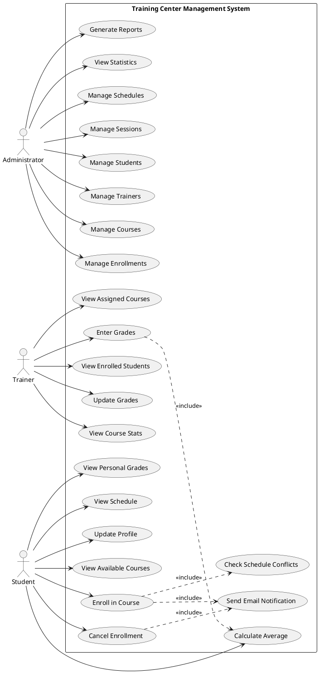

# Use Case Diagram - Training Center Management System

## Actors

### 👤 Administrator (ADMIN)

**Role**: Complete system management

- Manages all entities (students, trainers, courses)
- Configures system settings
- Views all reports and statistics
- Full CRUD access

### 👨‍🏫 Trainer (FORMATEUR)

**Role**: Course and grade management

- Manages assigned courses
- Enters and updates grades
- Views enrolled students
- Manages course schedules

### 🎓 Student (ETUDIANT)

**Role**: Course enrollment and consultation

- Views available courses
- Enrolls in courses
- Views personal grades
- Consults schedule/timetable
- Views profile information

---

## Use Cases by Actor

```
┌─────────────────────────────────────────────────────────────────────┐
│                    TRAINING CENTER MANAGEMENT SYSTEM                 │
│                                                                      │
│                                                                      │
│   ┌─────────────┐                                                   │
│   │             │                                                   │
│   │  ADMIN      │────────► UC1: Manage Students (CRUD)             │
│   │             │────────► UC2: Manage Trainers (CRUD)             │
│   └─────────────┘────────► UC3: Manage Courses (CRUD)              │
│         │                ► UC4: Manage Specializations             │
│         │                ► UC5: Manage Student Groups              │
│         │                ► UC6: Manage Academic Sessions           │
│         │                ► UC7: Assign Trainer to Course           │
│         │                ► UC8: View All Statistics                │
│         │                ► UC9: Generate Reports (PDF)             │
│         │                ► UC10: Manage Schedules                  │
│         │                                                           │
│   ┌─────────────┐                                                  │
│   │             │                                                  │
│   │  TRAINER    │────────► UC11: View Assigned Courses            │
│   │ (FORMATEUR) │────────► UC12: View Enrolled Students           │
│   │             │────────► UC13: Enter Grades                     │
│   └─────────────┘────────► UC14: Update Grades                    │
│         │                ► UC15: View Course Statistics           │
│         │                ► UC16: Manage Course Content            │
│         │                ► UC17: View Own Schedule                │
│         │                ► UC18: Receive Enrollment Notifications │
│         │                                                          │
│   ┌─────────────┐                                                 │
│   │             │                                                 │
│   │  STUDENT    │────────► UC19: View Available Courses          │
│   │  (ETUDIANT) │────────► UC20: Enroll in Course                │
│   │             │────────► UC21: Cancel Enrollment               │
│   └─────────────┘────────► UC22: View Personal Grades            │
│         │                ► UC23: View Course Details             │
│         │                ► UC24: View Personal Schedule          │
│         │                ► UC25: Calculate Average Grade         │
│         │                ► UC26: View Profile                    │
│         │                ► UC27: Update Profile Info             │
│         │                ► UC28: Receive Email Notifications     │
│         │                                                         │
│                                                                   │
│                    SYSTEM USE CASES                               │
│                    ─────────────────                              │
│                    UC29: Send Email Notification (automated)     │
│                    UC30: Check Schedule Conflicts (automated)    │
│                    UC31: Calculate Success Rate (automated)      │
│                                                                   │
└───────────────────────────────────────────────────────────────────┘
```

---

## Detailed Use Cases

### 🔵 UC20: Enroll in Course (Primary Use Case)

**Actor**: Student  
**Preconditions**:

- Student is authenticated
- Course exists and has available seats
- Student is not already enrolled

**Main Flow**:

1. Student navigates to available courses
2. System displays list of courses with details
3. Student selects a course
4. System checks for schedule conflicts
5. System checks enrollment capacity
6. System creates enrollment record
7. System sends confirmation email to student
8. System sends notification to trainer
9. System displays success message

**Alternative Flows**:

- **A1**: Schedule conflict detected
  - System displays conflict message
  - System suggests alternative courses
- **A2**: Course is full
  - System displays "course full" message
  - System offers waitlist option

**Postconditions**:

- Enrollment record created
- Email sent to student
- Notification sent to trainer
- Student can access course materials

---

### 🔵 UC13: Enter Grades

**Actor**: Trainer  
**Preconditions**:

- Trainer is authenticated
- Trainer is assigned to the course
- Students are enrolled in course

**Main Flow**:

1. Trainer selects course
2. System displays enrolled students
3. Trainer enters grade for student
4. System validates grade (0-20)
5. System saves grade
6. System recalculates student average
7. System displays confirmation

**Alternative Flows**:

- **A1**: Invalid grade entered
  - System displays error message
  - Trainer corrects grade

**Postconditions**:

- Grade recorded
- Student average updated

---

## Use Case Dependencies

```
UC20 (Enroll in Course)
    ├── <<includes>> UC30 (Check Schedule Conflicts)
    ├── <<includes>> UC29 (Send Email Notification)
    └── <<extends>> UC24 (View Personal Schedule)

UC13 (Enter Grades)
    ├── <<includes>> UC25 (Calculate Average Grade)
    └── <<includes>> UC31 (Calculate Success Rate)

UC9 (Generate Reports)
    ├── <<includes>> UC8 (View All Statistics)
    └── <<includes>> UC31 (Calculate Success Rate)
```

---

## PlantUML Code (for diagram generation)



---

## Summary Statistics

| Actor         | Number of Use Cases | Access Level                |
| ------------- | ------------------- | --------------------------- |
| Administrator | 10                  | Full CRUD                   |
| Trainer       | 7                   | Read + Update (own courses) |
| Student       | 8                   | Read + Enroll               |
| **Total**     | **31**              | -                           |
