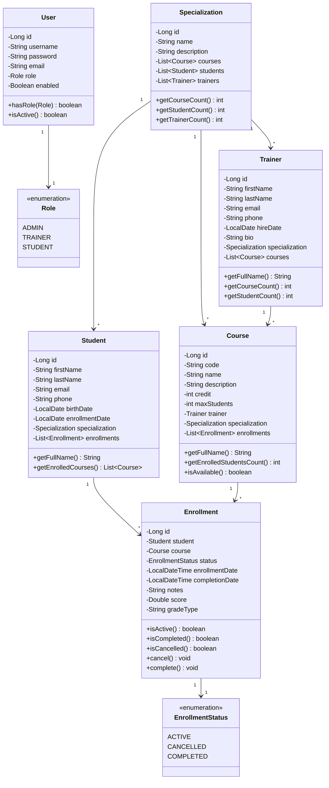

# Class Diagram - LearnHub Training Center

## Entity Relationships

### Core Entities
- **User**: Authentication entity with role-based access
- **Specialization**: Academic department/major
- **Trainer**: Instructors who teach courses
- **Student**: Learners enrolled in specializations
- **Course**: Classes with capacity limits
- **Enrollment**: Junction entity tracking student-course relationships with grades

### Key Relationships
- One Specialization has many Courses, Students, and Trainers
- One Trainer teaches many Courses
- One Course has many Enrollments
- One Student has many Enrollments
- Enrollment links Student and Course with additional metadata (status, grades)
