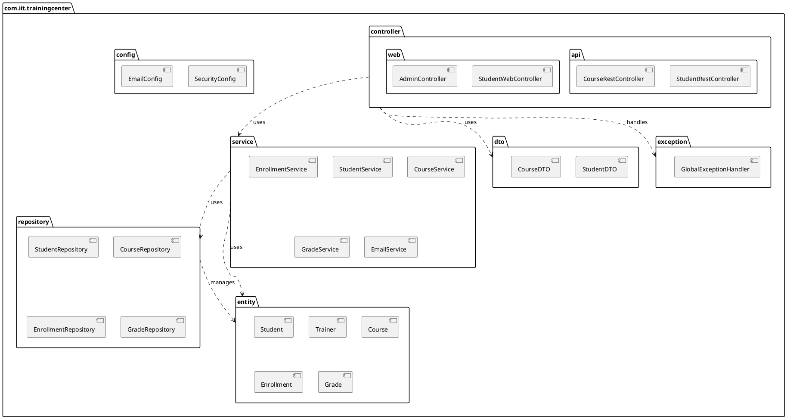

# Package Diagram (Diagramme de Paquetage) - Layered Architecture

## Overall Package Structure

```
┌────────────────────────────────────────────────────────────────────┐
│                 com.iit.trainingcenter                             │
│                                                                    │
│  ┌──────────────────────────────────────────────────────────┐    │
│  │  <<layer>>                                                │    │
│  │  controller                                               │    │
│  │  ┌──────────────┐        ┌──────────────┐               │    │
│  │  │ api          │        │ web          │               │    │
│  │  │ (REST API)   │        │ (Thymeleaf)  │               │    │
│  │  └──────────────┘        └──────────────┘               │    │
│  │  • StudentRestController  • StudentWebController         │    │
│  │  • CourseRestController   • AdminController              │    │
│  │  • EnrollmentRestController • DashboardController        │    │
│  └─────────────────────┬──────────────────────────────────┘    │
│                        │ depends on                             │
│                        ↓                                         │
│  ┌──────────────────────────────────────────────────────────┐   │
│  │  <<layer>>                                                │   │
│  │  service                                                  │   │
│  │  • StudentService                                         │   │
│  │  • TrainerService                                         │   │
│  │  • CourseService                                          │   │
│  │  • EnrollmentService                                      │   │
│  │  • GradeService                                           │   │
│  │  • EmailService                                           │   │
│  │  • ScheduleService                                        │   │
│  └─────────────────────┬──────────────────────────────────┘   │
│                        │ depends on                            │
│                        ↓                                        │
│  ┌──────────────────────────────────────────────────────────┐  │
│  │  <<layer>>                                                │  │
│  │  repository                                               │  │
│  │  • StudentRepository (extends JpaRepository)             │  │
│  │  • TrainerRepository                                     │  │
│  │  • CourseRepository                                      │  │
│  │  • EnrollmentRepository                                  │  │
│  │  • GradeRepository                                       │  │
│  │  • UserRepository                                        │  │
│  └─────────────────────┬──────────────────────────────────┘  │
│                        │ manages                               │
│                        ↓                                        │
│  ┌──────────────────────────────────────────────────────────┐  │
│  │  <<layer>>                                                │  │
│  │  entity                                                   │  │
│  │  • Student                                                │  │
│  │  • Trainer                                                │  │
│  │  • Course                                                 │  │
│  │  • Enrollment                                             │  │
│  │  • Grade                                                  │  │
│  │  • User                                                   │  │
│  │  • Specialization                                         │  │
│  │  • StudentGroup                                           │  │
│  │  • Session                                                │  │
│  │  • Schedule                                               │  │
│  └──────────────────────────────────────────────────────────┘  │
│                                                                  │
│  ┌──────────────────────────────────────────────────────────┐  │
│  │  dto (Data Transfer Objects)                              │  │
│  │  • StudentDTO                                             │  │
│  │  • CourseDTO                                              │  │
│  │  • EnrollmentDTO                                          │  │
│  │  • GradeDTO                                               │  │
│  └──────────────────────────────────────────────────────────┘  │
│                                                                  │
│  ┌──────────────────────────────────────────────────────────┐  │
│  │  config                                                    │  │
│  │  • SecurityConfig                                          │  │
│  │  • EmailConfig                                             │  │
│  │  • WebConfig                                               │  │
│  └──────────────────────────────────────────────────────────┘  │
│                                                                  │
│  ┌──────────────────────────────────────────────────────────┐  │
│  │  exception                                                 │  │
│  │  • GlobalExceptionHandler                                  │  │
│  │  • StudentNotFoundException                                │  │
│  │  • EnrollmentException                                     │  │
│  │  • ScheduleConflictException                               │  │
│  └──────────────────────────────────────────────────────────┘  │
│                                                                  │
│  ┌──────────────────────────────────────────────────────────┐  │
│  │  util                                                      │  │
│  │  • DateUtils                                               │  │
│  │  • ValidationUtils                                         │  │
│  │  • PDFGenerator                                            │  │
│  └──────────────────────────────────────────────────────────┘  │
└────────────────────────────────────────────────────────────────┘
```

---

## Detailed Package Breakdown

### 📦 1. controller Package

#### 📂 controller.api (REST API - CSR)

**Purpose**: Expose RESTful endpoints for Angular/React frontend

**Classes**:

- `StudentRestController.java`
  - GET /api/students
  - POST /api/students
  - PUT /api/students/{id}
  - DELETE /api/students/{id}
- `CourseRestController.java`
  - GET /api/courses
  - POST /api/courses
  - GET /api/courses/{id}/students
- `EnrollmentRestController.java`
  - POST /api/enrollments
  - DELETE /api/enrollments/{id}
- `GradeRestController.java`
  - POST /api/grades
  - GET /api/students/{id}/grades

**Dependencies**:

- ↓ service package
- ↓ dto package

---

#### 📂 controller.web (Thymeleaf - SSR)

**Purpose**: Server-side rendering for admin interface

**Classes**:

- `StudentWebController.java`
  - GET /students → list all students
  - GET /students/new → form
  - POST /students → create
- `TrainerWebController.java`
- `CourseWebController.java`
- `AdminController.java`
- `DashboardController.java`
  - GET / → dashboard with statistics

**Dependencies**:

- ↓ service package
- ↓ entity package

---

### 📦 2. service Package

**Purpose**: Business logic layer

**Classes**:

- `StudentService.java`
  - createStudent(Student)
  - updateStudent(Long id, Student)
  - deleteStudent(Long id)
  - getStudent(Long id)
  - getAllStudents()
  - searchStudents(String query)
- `CourseService.java`
  - createCourse(Course)
  - assignTrainer(Long courseId, Long trainerId)
  - getAvailableCourses()
  - getCourseStatistics(Long courseId)
- `EnrollmentService.java`
  - enrollStudent(Long studentId, Long courseId)
  - cancelEnrollment(Long enrollmentId)
  - checkScheduleConflict(Long studentId, Long courseId)
  - getStudentEnrollments(Long studentId)
- `GradeService.java`
  - assignGrade(Long studentId, Long courseId, Double value)
  - calculateStudentAverage(Long studentId)
  - getCourseSuccessRate(Long courseId)
- `EmailService.java`
  - sendEnrollmentConfirmation(Student, Course)
  - sendTrainerNotification(Trainer, Course, Student)
- `ScheduleService.java`
  - createSchedule(Schedule)
  - checkConflicts(Schedule)
  - getStudentSchedule(Long studentId)
  - getTrainerSchedule(Long trainerId)

**Dependencies**:

- ↓ repository package
- ↓ entity package
- ↓ exception package

---

### 📦 3. repository Package

**Purpose**: Data access layer (Spring Data JPA)

**Interfaces** (extend JpaRepository):

- `StudentRepository`

  ```java
  Optional<Student> findByMatricule(String matricule);
  List<Student> findByNameContaining(String name);
  ```

- `TrainerRepository`

  ```java
  List<Trainer> findBySpecialty(String specialty);
  ```

- `CourseRepository`

  ```java
  List<Course> findByTrainerId(Long trainerId);
  List<Course> findByTitleContaining(String title);
  ```

- `EnrollmentRepository`

  ```java
  List<Enrollment> findByStudentId(Long studentId);
  List<Enrollment> findByCourseId(Long courseId);
  boolean existsByStudentIdAndCourseId(Long studentId, Long courseId);
  ```

- `GradeRepository`
  ```java
  List<Grade> findByStudentId(Long studentId);
  Optional<Grade> findByStudentIdAndCourseId(Long studentId, Long courseId);
  @Query("SELECT AVG(g.value) FROM Grade g WHERE g.student.id = :studentId")
  Double calculateAverageByStudentId(Long studentId);
  ```

**Dependencies**:

- ↓ entity package

---

### 📦 4. entity Package

**Purpose**: Domain models with JPA annotations

**Classes**:

- `Student.java`
- `Trainer.java`
- `Course.java`
- `Enrollment.java`
- `Grade.java`
- `User.java` (for Spring Security)
- `Specialization.java`
- `StudentGroup.java`
- `Session.java` (Academic semester/year)
- `Schedule.java`

**Dependencies**: None (lowest layer)

---

### 📦 5. dto Package

**Purpose**: Data transfer objects for API

**Classes**:

- `StudentDTO.java`
- `CourseDTO.java`
- `EnrollmentDTO.java`
- `GradeDTO.java`
- `EnrollmentRequestDTO.java`
- `GradeRequestDTO.java`

---

### 📦 6. config Package

**Purpose**: Application configuration

**Classes**:

- `SecurityConfig.java` - Spring Security setup
- `EmailConfig.java` - Email configuration
- `WebConfig.java` - CORS, interceptors
- `SwaggerConfig.java` - API documentation

---

### 📦 7. exception Package

**Purpose**: Custom exceptions and global error handling

**Classes**:

- `GlobalExceptionHandler.java` (@ControllerAdvice)
- `StudentNotFoundException.java`
- `TrainerNotFoundException.java`
- `CourseNotFoundException.java`
- `EnrollmentException.java`
- `ScheduleConflictException.java`
- `InvalidGradeException.java`

---

## Package Dependencies (PlantUML)



---

## Dependency Rules

✅ **Allowed Dependencies**:

- controller → service
- controller → dto
- service → repository
- service → entity
- repository → entity

❌ **Forbidden Dependencies**:

- entity → any other layer
- repository → service
- repository → controller

---

## Maven Project Structure

```
training-center-management/
├── src/
│   ├── main/
│   │   ├── java/
│   │   │   └── com/
│   │   │       └── iit/
│   │   │           └── trainingcenter/
│   │   │               ├── controller/
│   │   │               │   ├── api/
│   │   │               │   └── web/
│   │   │               ├── service/
│   │   │               ├── repository/
│   │   │               ├── entity/
│   │   │               ├── dto/
│   │   │               ├── config/
│   │   │               ├── exception/
│   │   │               └── util/
│   │   └── resources/
│   │       ├── templates/          # Thymeleaf
│   │       ├── static/             # CSS, JS
│   │       └── application.properties
│   └── test/
│       └── java/
│           └── com/iit/trainingcenter/
└── pom.xml
```
