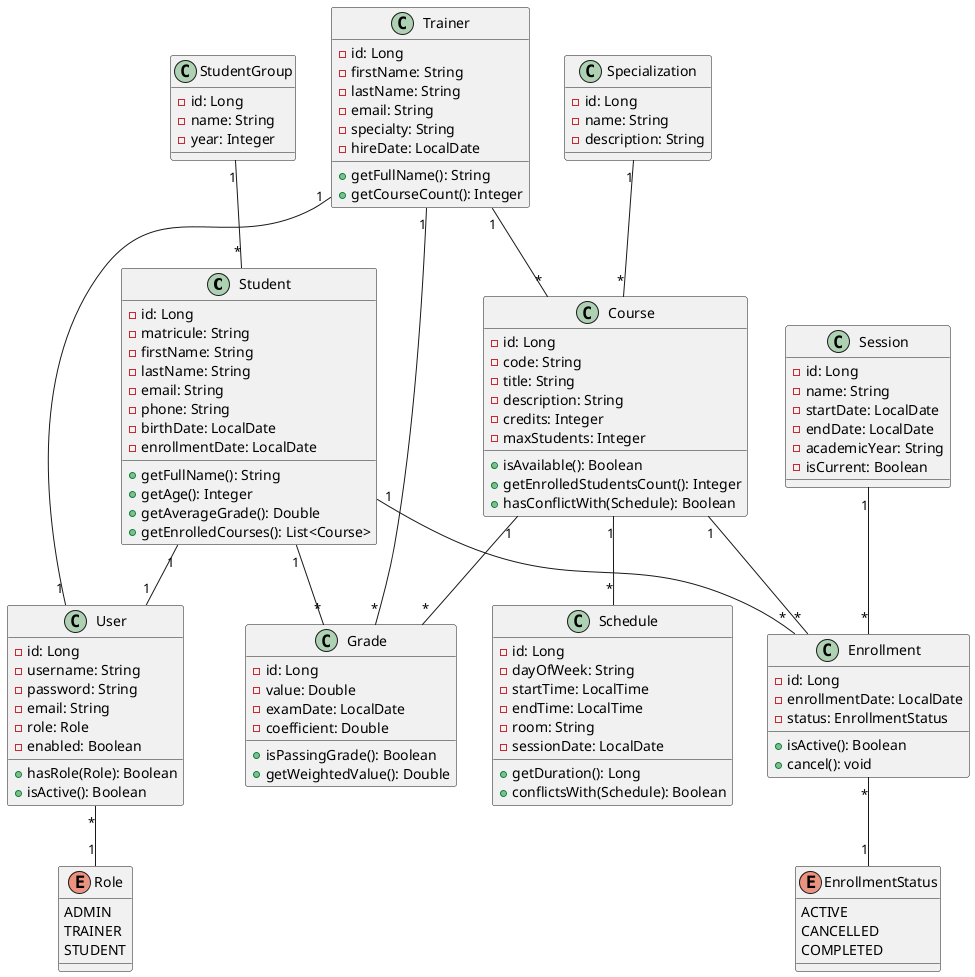

# Class Diagram - Training Center Management System

## Core Domain Entities with Relationships

```
┌─────────────────────────────────────────────────────────────────────────┐
│                                                                         │
│  ┌────────────────────┐              ┌────────────────────┐           │
│  │   Specialization   │              │   StudentGroup     │           │
│  ├────────────────────┤              ├────────────────────┤           │
│  │ -id: Long          │              │ -id: Long          │           │
│  │ -name: String      │              │ -name: String      │           │
│  │ -description: String│             │ -year: Integer     │           │
│  │ -courses: List     │              │ -students: List    │           │
│  └────────────────────┘              └────────────────────┘           │
│          △                                     △                        │
│          │                                     │                        │
│          │                                     │                        │
│          │                                     │                        │
│  ┌───────────────────────────────────────────────────────────┐        │
│  │                    Course                                  │        │
│  ├───────────────────────────────────────────────────────────┤        │
│  │ -id: Long                                                  │        │
│  │ -code: String                                              │        │
│  │ -title: String                                             │        │
│  │ -description: String                                       │        │
│  │ -credits: Integer                                          │        │
│  │ -maxStudents: Integer                                      │        │
│  │ -trainer: Trainer                                          │        │
│  │ -specialization: Specialization                            │        │
│  │ -enrollments: List<Enrollment>                             │        │
│  │ -schedules: List<Schedule>                                 │        │
│  │ -createdDate: LocalDateTime                                │        │
│  ├───────────────────────────────────────────────────────────┤        │
│  │ +getEnrolledStudentsCount(): Integer                       │        │
│  │ +isAvailable(): Boolean                                    │        │
│  │ +hasConflictWith(Schedule): Boolean                        │        │
│  └─────────────┬──────────────┬──────────────────────────────┘        │
│                │              │                                         │
│                │              │ 1                                       │
│       1        │              └──────────────┐                          │
│    ┌───────────┘                             │                          │
│    │                                         │                          │
│    │ *                                       │ *                        │
│  ┌─────────────────────┐          ┌─────────────────────┐             │
│  │      Trainer        │          │    Enrollment       │             │
│  ├─────────────────────┤          ├─────────────────────┤             │
│  │ -id: Long           │          │ -id: Long           │             │
│  │ -firstName: String  │          │ -enrollmentDate: LD │             │
│  │ -lastName: String   │          │ -status: EnrollStatus│            │
│  │ -email: String      │          │ -student: Student   │             │
│  │ -phone: String      │          │ -course: Course     │             │
│  │ -specialty: String  │          │ -session: Session   │             │
│  │ -courses: List      │          └──────────┬──────────┘             │
│  │ -user: User         │                     │                         │
│  │ -hireDate: LocalDate│                     │ *                       │
│  ├─────────────────────┤                     │                         │
│  │ +getFullName(): String                    │                         │
│  │ +getCourseCount(): Integer                │ 1                       │
│  └─────────────────────┘          ┌──────────────────────┐            │
│                                    │      Student         │            │
│  ┌─────────────────────┐          ├──────────────────────┤            │
│  │      Session        │          │ -id: Long            │            │
│  ├─────────────────────┤          │ -matricule: String   │            │
│  │ -id: Long           │          │ -firstName: String   │            │
│  │ -name: String       │          │ -lastName: String    │            │
│  │ -startDate: LD      │    1  *  │ -email: String       │            │
│  │ -endDate: LD        │◄─────────┤ -phone: String       │            │
│  │ -academicYear: String          │ -birthDate: LocalDate│            │
│  │ -isCurrent: Boolean │          │ -enrollmentDate: LD  │            │
│  └─────────────────────┘          │ -group: StudentGroup │            │
│                                    │ -user: User          │            │
│                                    │ -enrollments: List   │            │
│                                    │ -grades: List        │            │
│                                    ├──────────────────────┤            │
│                                    │ +getFullName(): String            │
│                                    │ +getAge(): Integer   │            │
│                                    │ +getAverageGrade(): Double        │
│                                    │ +getEnrolledCourses(): List       │
│                                    └──────────┬───────────┘            │
│                                               │ 1                       │
│                                               │                         │
│  ┌─────────────────────┐                     │                         │
│  │       Grade         │                     │                         │
│  ├─────────────────────┤                     │ *                       │
│  │ -id: Long           │                     │                         │
│  │ -value: Double      │◄────────────────────┘                         │
│  │ -examDate: LD       │                                               │
│  │ -coefficient: Double│          ┌──────────────────────┐            │
│  │ -student: Student   │          │      Schedule        │            │
│  │ -course: Course     │          ├──────────────────────┤            │
│  │ -trainer: Trainer   │          │ -id: Long            │            │
│  │ -createdAt: LDT     │          │ -dayOfWeek: String   │            │
│  ├─────────────────────┤          │ -startTime: LocalTime│            │
│  │ +isPassingGrade(): B│          │ -endTime: LocalTime  │            │
│  │ +getWeightedValue():D          │ -room: String        │            │
│  └─────────────────────┘          │ -course: Course      │            │
│                                    │ -sessionDate: LD     │            │
│                                    ├──────────────────────┤            │
│  ┌─────────────────────┐          │ +getDuration(): Long │            │
│  │        User         │          │ +conflictsWith(S): Boolean        │
│  ├─────────────────────┤          └──────────────────────┘            │
│  │ -id: Long           │                                               │
│  │ -username: String   │                                               │
│  │ -password: String   │                                               │
│  │ -email: String      │                                               │
│  │ -role: Role         │                                               │
│  │ -enabled: Boolean   │                                               │
│  │ -student: Student   │                                               │
│  │ -trainer: Trainer   │                                               │
│  │ -createdAt: LDT     │                                               │
│  │ -lastLogin: LDT     │                                               │
│  ├─────────────────────┤                                               │
│  │ +hasRole(Role): Boolean                                             │
│  │ +isActive(): Boolean│                                               │
│  └─────────────────────┘                                               │
│                                                                         │
│  ┌─────────────────────┐                                               │
│  │   <<enumeration>>   │                                               │
│  │        Role         │                                               │
│  ├─────────────────────┤                                               │
│  │ ADMIN               │                                               │
│  │ TRAINER             │                                               │
│  │ STUDENT             │                                               │
│  └─────────────────────┘                                               │
│                                                                         │
│  ┌─────────────────────┐                                               │
│  │   <<enumeration>>   │                                               │
│  │  EnrollmentStatus   │                                               │
│  ├─────────────────────┤                                               │
│  │ ACTIVE              │                                               │
│  │ CANCELLED           │                                               │
│  │ COMPLETED           │                                               │
│  └─────────────────────┘                                               │
│                                                                         │
└─────────────────────────────────────────────────────────────────────────┘

Legend:
LD  = LocalDate
LDT = LocalDateTime
```

---

## Detailed Entity Specifications

### 🎓 Student Entity

```java
@Entity
@Table(name = "students")
public class Student {
    @Id
    @GeneratedValue(strategy = GenerationType.IDENTITY)
    private Long id;

    @Column(unique = true, nullable = false, length = 20)
    private String matricule;

    @Column(nullable = false, length = 50)
    private String firstName;

    @Column(nullable = false, length = 50)
    private String lastName;

    @Column(unique = true, nullable = false, length = 100)
    private String email;

    @Column(length = 20)
    private String phone;

    @Column(nullable = false)
    private LocalDate birthDate;

    @Column(nullable = false)
    private LocalDate enrollmentDate;

    // Relationships
    @ManyToOne
    @JoinColumn(name = "group_id")
    private StudentGroup group;

    @OneToOne(mappedBy = "student", cascade = CascadeType.ALL)
    private User user;

    @OneToMany(mappedBy = "student", cascade = CascadeType.ALL)
    private List<Enrollment> enrollments = new ArrayList<>();

    @OneToMany(mappedBy = "student", cascade = CascadeType.ALL)
    private List<Grade> grades = new ArrayList<>();

    @Column(updatable = false)
    @CreatedDate
    private LocalDateTime createdAt;

    @LastModifiedDate
    private LocalDateTime updatedAt;

    // Business Methods
    public String getFullName() {
        return firstName + " " + lastName;
    }

    public Integer getAge() {
        return Period.between(birthDate, LocalDate.now()).getYears();
    }

    public Double getAverageGrade() {
        if (grades.isEmpty()) return 0.0;
        return grades.stream()
            .mapToDouble(Grade::getValue)
            .average()
            .orElse(0.0);
    }

    public List<Course> getEnrolledCourses() {
        return enrollments.stream()
            .filter(e -> e.getStatus() == EnrollmentStatus.ACTIVE)
            .map(Enrollment::getCourse)
            .collect(Collectors.toList());
    }
}
```

---

### 👨‍🏫 Trainer Entity

```java
@Entity
@Table(name = "trainers")
public class Trainer {
    @Id
    @GeneratedValue(strategy = GenerationType.IDENTITY)
    private Long id;

    @Column(nullable = false, length = 50)
    private String firstName;

    @Column(nullable = false, length = 50)
    private String lastName;

    @Column(unique = true, nullable = false, length = 100)
    private String email;

    @Column(length = 20)
    private String phone;

    @Column(nullable = false, length = 100)
    private String specialty;

    @Column(nullable = false)
    private LocalDate hireDate;

    // Relationships
    @OneToMany(mappedBy = "trainer")
    private List<Course> courses = new ArrayList<>();

    @OneToOne(mappedBy = "trainer", cascade = CascadeType.ALL)
    private User user;

    @Column(updatable = false)
    @CreatedDate
    private LocalDateTime createdAt;

    // Business Methods
    public String getFullName() {
        return firstName + " " + lastName;
    }

    public Integer getCourseCount() {
        return courses.size();
    }

    public List<Student> getAllStudents() {
        return courses.stream()
            .flatMap(c -> c.getEnrollments().stream())
            .map(Enrollment::getStudent)
            .distinct()
            .collect(Collectors.toList());
    }
}
```

---

### 📚 Course Entity

```java
@Entity
@Table(name = "courses")
public class Course {
    @Id
    @GeneratedValue(strategy = GenerationType.IDENTITY)
    private Long id;

    @Column(unique = true, nullable = false, length = 20)
    private String code;

    @Column(nullable = false, length = 100)
    private String title;

    @Column(length = 500)
    private String description;

    @Column(nullable = false)
    private Integer credits;

    @Column(nullable = false)
    private Integer maxStudents;

    // Relationships
    @ManyToOne
    @JoinColumn(name = "trainer_id")
    private Trainer trainer;

    @ManyToOne
    @JoinColumn(name = "specialization_id")
    private Specialization specialization;

    @OneToMany(mappedBy = "course", cascade = CascadeType.ALL)
    private List<Enrollment> enrollments = new ArrayList<>();

    @OneToMany(mappedBy = "course", cascade = CascadeType.ALL)
    private List<Schedule> schedules = new ArrayList<>();

    @Column(updatable = false)
    @CreatedDate
    private LocalDateTime createdAt;

    // Business Methods
    public Integer getEnrolledStudentsCount() {
        return (int) enrollments.stream()
            .filter(e -> e.getStatus() == EnrollmentStatus.ACTIVE)
            .count();
    }

    public Boolean isAvailable() {
        return getEnrolledStudentsCount() < maxStudents;
    }

    public Boolean hasConflictWith(Schedule otherSchedule) {
        return schedules.stream()
            .anyMatch(s -> s.conflictsWith(otherSchedule));
    }

    public Double getSuccessRate() {
        List<Grade> allGrades = enrollments.stream()
            .flatMap(e -> e.getStudent().getGrades().stream())
            .filter(g -> g.getCourse().equals(this))
            .collect(Collectors.toList());

        if (allGrades.isEmpty()) return 0.0;

        long passingGrades = allGrades.stream()
            .filter(Grade::isPassingGrade)
            .count();

        return (double) passingGrades / allGrades.size() * 100;
    }
}
```

---

### 📋 Enrollment Entity

```java
@Entity
@Table(name = "enrollments",
    uniqueConstraints = @UniqueConstraint(columnNames = {"student_id", "course_id"}))
public class Enrollment {
    @Id
    @GeneratedValue(strategy = GenerationType.IDENTITY)
    private Long id;

    @Column(nullable = false)
    private LocalDate enrollmentDate;

    @Enumerated(EnumType.STRING)
    @Column(nullable = false)
    private EnrollmentStatus status;

    // Relationships
    @ManyToOne
    @JoinColumn(name = "student_id", nullable = false)
    private Student student;

    @ManyToOne
    @JoinColumn(name = "course_id", nullable = false)
    private Course course;

    @ManyToOne
    @JoinColumn(name = "session_id")
    private Session session;

    @Column(updatable = false)
    @CreatedDate
    private LocalDateTime createdAt;

    // Business Methods
    public Boolean isActive() {
        return status == EnrollmentStatus.ACTIVE;
    }

    public void cancel() {
        this.status = EnrollmentStatus.CANCELLED;
    }
}
```

---

### 📝 Grade Entity

```java
@Entity
@Table(name = "grades",
    uniqueConstraints = @UniqueConstraint(columnNames = {"student_id", "course_id"}))
public class Grade {
    @Id
    @GeneratedValue(strategy = GenerationType.IDENTITY)
    private Long id;

    @Column(nullable = false)
    @Min(0)
    @Max(20)
    private Double value;

    @Column(nullable = false)
    private LocalDate examDate;

    @Column(nullable = false)
    private Double coefficient = 1.0;

    // Relationships
    @ManyToOne
    @JoinColumn(name = "student_id", nullable = false)
    private Student student;

    @ManyToOne
    @JoinColumn(name = "course_id", nullable = false)
    private Course course;

    @ManyToOne
    @JoinColumn(name = "trainer_id")
    private Trainer trainer;

    @Column(updatable = false)
    @CreatedDate
    private LocalDateTime createdAt;

    // Business Methods
    public Boolean isPassingGrade() {
        return value >= 10.0;
    }

    public Double getWeightedValue() {
        return value * coefficient;
    }
}
```

---

### 🔐 User Entity (Security)

```java
@Entity
@Table(name = "users")
public class User implements UserDetails {
    @Id
    @GeneratedValue(strategy = GenerationType.IDENTITY)
    private Long id;

    @Column(unique = true, nullable = false, length = 50)
    private String username;

    @Column(nullable = false)
    private String password;

    @Column(unique = true, nullable = false)
    private String email;

    @Enumerated(EnumType.STRING)
    @Column(nullable = false)
    private Role role;

    @Column(nullable = false)
    private Boolean enabled = true;

    // Relationships
    @OneToOne
    @JoinColumn(name = "student_id")
    private Student student;

    @OneToOne
    @JoinColumn(name = "trainer_id")
    private Trainer trainer;

    @Column(updatable = false)
    @CreatedDate
    private LocalDateTime createdAt;

    private LocalDateTime lastLogin;

    // Business Methods
    public Boolean hasRole(Role role) {
        return this.role == role;
    }

    public Boolean isActive() {
        return enabled;
    }

    // UserDetails Implementation
    @Override
    public Collection<? extends GrantedAuthority> getAuthorities() {
        return List.of(new SimpleGrantedAuthority("ROLE_" + role.name()));
    }

    @Override
    public boolean isAccountNonExpired() { return true; }

    @Override
    public boolean isAccountNonLocked() { return true; }

    @Override
    public boolean isCredentialsNonExpired() { return true; }

    @Override
    public boolean isEnabled() { return enabled; }
}
```

---

### 📅 Schedule Entity

```java
@Entity
@Table(name = "schedules")
public class Schedule {
    @Id
    @GeneratedValue(strategy = GenerationType.IDENTITY)
    private Long id;

    @Column(nullable = false)
    private String dayOfWeek; // MONDAY, TUESDAY, etc.

    @Column(nullable = false)
    private LocalTime startTime;

    @Column(nullable = false)
    private LocalTime endTime;

    @Column(length = 50)
    private String room;

    @Column(nullable = false)
    private LocalDate sessionDate;

    @ManyToOne
    @JoinColumn(name = "course_id", nullable = false)
    private Course course;

    // Business Methods
    public Long getDuration() {
        return Duration.between(startTime, endTime).toMinutes();
    }

    public Boolean conflictsWith(Schedule other) {
        if (!this.sessionDate.equals(other.sessionDate)) {
            return false;
        }
        return this.startTime.isBefore(other.endTime) &&
               this.endTime.isAfter(other.startTime);
    }
}
```

---

## Relationships Summary

| Relationship            | Entity A       | Entity B   | Type | Owner      |
| ----------------------- | -------------- | ---------- | ---- | ---------- |
| Student - Enrollment    | Student        | Enrollment | 1:N  | Enrollment |
| Course - Enrollment     | Course         | Enrollment | 1:N  | Enrollment |
| Student - Grade         | Student        | Grade      | 1:N  | Grade      |
| Course - Grade          | Course         | Grade      | 1:N  | Grade      |
| Trainer - Course        | Trainer        | Course     | 1:N  | Course     |
| Trainer - Grade         | Trainer        | Grade      | 1:N  | Grade      |
| Course - Schedule       | Course         | Schedule   | 1:N  | Schedule   |
| Student - User          | Student        | User       | 1:1  | User       |
| Trainer - User          | Trainer        | User       | 1:1  | User       |
| StudentGroup - Student  | StudentGroup   | Student    | 1:N  | Student    |
| Specialization - Course | Specialization | Course     | 1:N  | Course     |
| Session - Enrollment    | Session        | Enrollment | 1:N  | Enrollment |

---

## PlantUML Code


