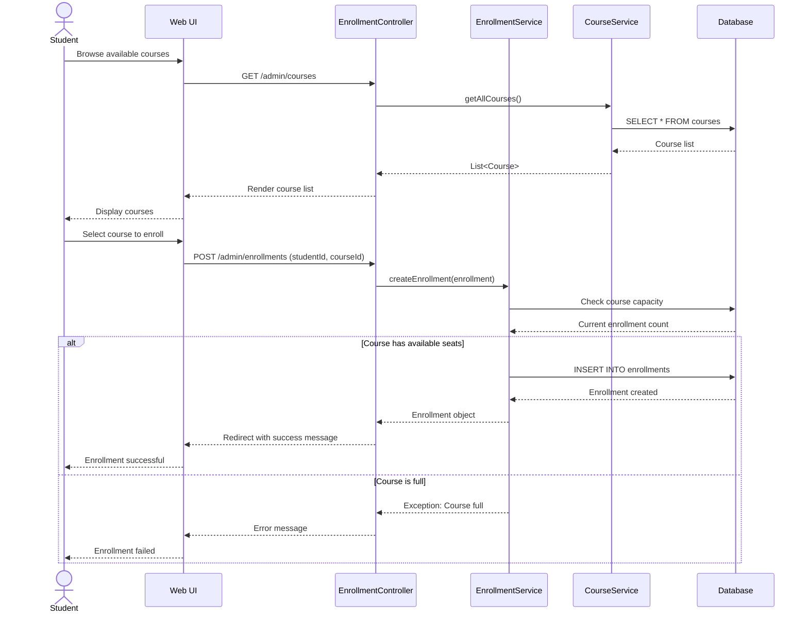
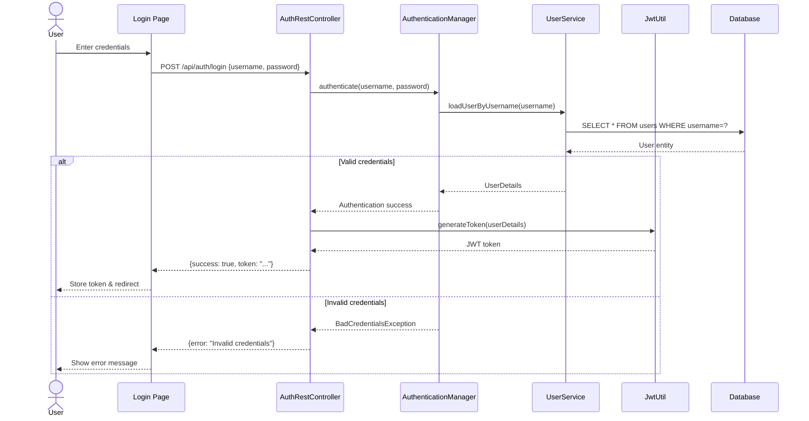
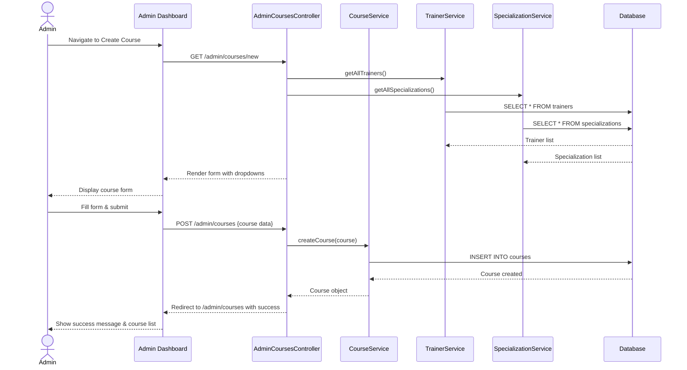
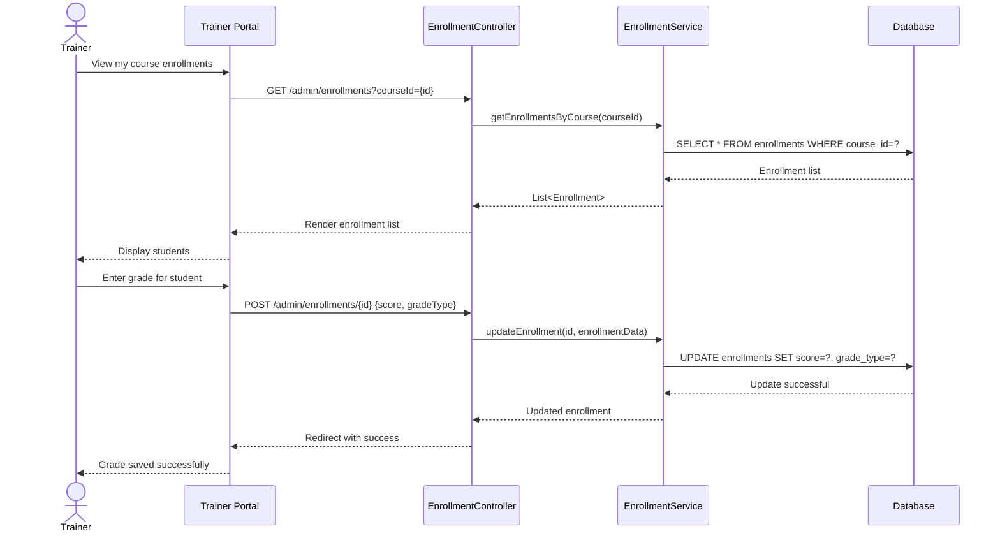

# Sequence Diagrams - LearnHub Training Center

## 1. Student Enrollment Flow

```mermaid
sequenceDiagram
    actor Student
    participant UI as Web UI
    participant Controller as EnrollmentController
    participant Service as EnrollmentService
    participant CourseService
    participant DB as Database
    
    Student->>UI: Browse available courses
    UI->>Controller: GET /admin/courses
    Controller->>CourseService: getAllCourses()
    CourseService->>DB: SELECT * FROM courses
    DB-->>CourseService: Course list
    CourseService-->>Controller: List<Course>
    Controller-->>UI: Render course list
    UI-->>Student: Display courses
    
    Student->>UI: Select course to enroll
    UI->>Controller: POST /admin/enrollments (studentId, courseId)
    Controller->>Service: createEnrollment(enrollment)
    Service->>DB: Check course capacity
    DB-->>Service: Current enrollment count
    
    alt Course has available seats
        Service->>DB: INSERT INTO enrollments
        DB-->>Service: Enrollment created
        Service-->>Controller: Enrollment object
        Controller-->>UI: Redirect with success message
        UI-->>Student: Enrollment successful
    else Course is full
        Service-->>Controller: Exception: Course full
        Controller-->>UI: Error message
        UI-->>Student: Enrollment failed
    end
```

## 2. JWT Authentication Flow

```mermaid
sequenceDiagram
    actor User
    participant UI as Login Page
    participant AuthController as AuthRestController
    participant AuthManager as AuthenticationManager
    participant UserService
    participant JwtUtil
    participant DB as Database
    
    User->>UI: Enter credentials
    UI->>AuthController: POST /api/auth/login {username, password}
    AuthController->>AuthManager: authenticate(username, password)
    AuthManager->>UserService: loadUserByUsername(username)
    UserService->>DB: SELECT * FROM users WHERE username=?
    DB-->>UserService: User entity
    
    alt Valid credentials
        UserService-->>AuthManager: UserDetails
        AuthManager-->>AuthController: Authentication success
        AuthController->>JwtUtil: generateToken(userDetails)
        JwtUtil-->>AuthController: JWT token
        AuthController-->>UI: {success: true, token: "..."}
        UI-->>User: Store token & redirect
    else Invalid credentials
        AuthManager-->>AuthController: BadCredentialsException
        AuthController-->>UI: {error: "Invalid credentials"}
        UI-->>User: Show error message
    end
```

## 3. Admin CRUD Operations (Course Management)

```mermaid
sequenceDiagram
    actor Admin
    participant UI as Admin Dashboard
    participant Controller as AdminCoursesController
    participant Service as CourseService
    participant TrainerService
    participant SpecService as SpecializationService
    participant DB as Database
    
    Admin->>UI: Navigate to Create Course
    UI->>Controller: GET /admin/courses/new
    Controller->>TrainerService: getAllTrainers()
    Controller->>SpecService: getAllSpecializations()
    TrainerService->>DB: SELECT * FROM trainers
    SpecService->>DB: SELECT * FROM specializations
    DB-->>TrainerService: Trainer list
    DB-->>SpecService: Specialization list
    Controller-->>UI: Render form with dropdowns
    UI-->>Admin: Display course form
    
    Admin->>UI: Fill form & submit
    UI->>Controller: POST /admin/courses {course data}
    Controller->>Service: createCourse(course)
    Service->>DB: INSERT INTO courses
    DB-->>Service: Course created
    Service-->>Controller: Course object
    Controller-->>UI: Redirect to /admin/courses with success
    UI-->>Admin: Show success message & course list
```

## 4. Grade Assignment Flow

```mermaid
sequenceDiagram
    actor Trainer
    participant UI as Trainer Portal
    participant Controller as EnrollmentController
    participant Service as EnrollmentService
    participant DB as Database
    
    Trainer->>UI: View my course enrollments
    UI->>Controller: GET /admin/enrollments?courseId={id}
    Controller->>Service: getEnrollmentsByCourse(courseId)
    Service->>DB: SELECT * FROM enrollments WHERE course_id=?
    DB-->>Service: Enrollment list
    Service-->>Controller: List<Enrollment>
    Controller-->>UI: Render enrollment list
    UI-->>Trainer: Display students
    
    Trainer->>UI: Enter grade for student
    UI->>Controller: POST /admin/enrollments/{id} {score, gradeType}
    Controller->>Service: updateEnrollment(id, enrollmentData)
    Service->>DB: UPDATE enrollments SET score=?, grade_type=?
    DB-->>Service: Update successful
    Service-->>Controller: Updated enrollment
    Controller-->>UI: Redirect with success
    UI-->>Trainer: Grade saved successfully
```
