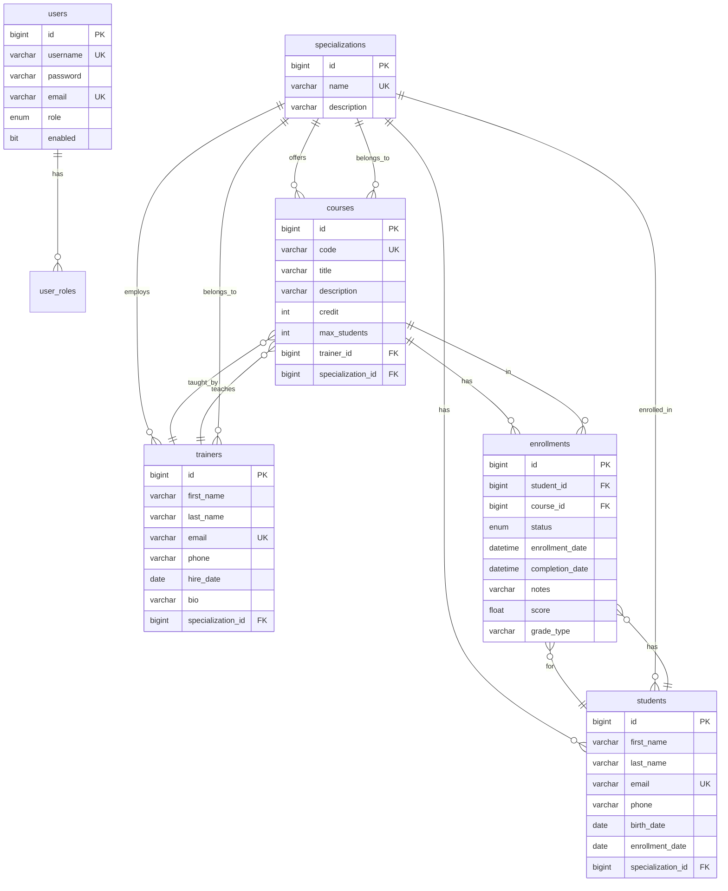

# Entity-Relationship Diagram - LearnHub Database

## Database Schema Details

### Tables Overview

#### users
- Primary authentication table
- Stores credentials and role information
- `role` enum: ADMIN, TRAINER, STUDENT
- `enabled` flag for account activation

#### specializations
- Academic departments or majors
- Central entity linking students, trainers, and courses
- Examples: Computer Science, Business

#### trainers
- Instructor information
- Linked to specialization
- Can teach multiple courses

#### students
- Learner information
- Enrolled in one specialization
- Can take multiple courses via enrollments

#### courses
- Class/module information
- Has capacity limit (`max_students`)
- Belongs to one specialization
- Taught by one trainer
- `credit` field stores academic credits (singular)

#### enrollments
- Junction table with additional metadata
- Links students to courses
- Tracks enrollment lifecycle (ACTIVE → COMPLETED/CANCELLED)
- Stores grades and completion information

### Constraints

**Unique Constraints:**
- `users.username`
- `users.email`
- `trainers.email`
- `students.email`
- `courses.code`
- `specializations.name`

**Foreign Key Constraints:**
- `trainers.specialization_id` → `specializations.id`
- `students.specialization_id` → `specializations.id`
- `courses.trainer_id` → `trainers.id`
- `courses.specialization_id` → `specializations.id`
- `enrollments.student_id` → `students.id`
- `enrollments.course_id` → `courses.id`

### Indexes (Recommended)
- `idx_enrollments_student` on `enrollments.student_id`
- `idx_enrollments_course` on `enrollments.course_id`
- `idx_enrollments_status` on `enrollments.status`
- `idx_courses_trainer` on `courses.trainer_id`
- `idx_courses_specialization` on `courses.specialization_id`
