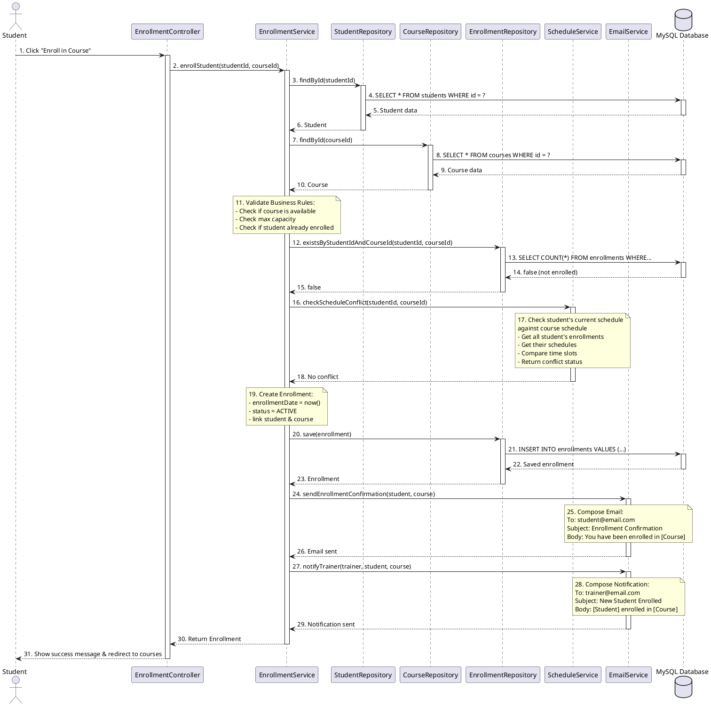
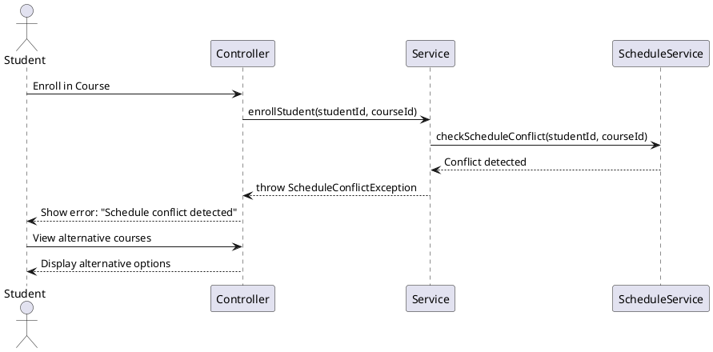

# Sequence Diagram - Enroll Student in Course

## Scenario: Student Enrolling in a Course

This is the primary use case demonstrating interaction between all layers.

---

## Participants

- **Student (User)**: Authenticated student
- **EnrollmentWebController**: Thymeleaf controller
- **EnrollmentService**: Business logic layer
- **StudentRepository**: Student data access
- **CourseRepository**: Course data access
- **EnrollmentRepository**: Enrollment data access
- **ScheduleService**: Schedule conflict checking
- **EmailService**: Notification service
- **Database**: MySQL database

---

## Sequence Diagram

```
┌─────┐     ┌──────────┐  ┌────────────┐  ┌────────┐  ┌──────────┐  ┌──────────┐  ┌──────────┐  ┌──────────┐  ┌─────────┐
│     │     │Enrollment│  │Enrollment  │  │Student │  │Course    │  │Enrollment│  │Schedule  │  │Email     │  │Database │
│Student    │Controller│  │Service     │  │Repo    │  │Repo      │  │Repo      │  │Service   │  │Service   │  │         │
└──┬──┘     └────┬─────┘  └─────┬──────┘  └───┬────┘  └────┬─────┘  └────┬─────┘  └────┬─────┘  └────┬─────┘  └────┬────┘
   │             │                │             │            │             │             │             │             │
   │1. Click     │                │             │            │             │             │             │             │
   │"Enroll"     │                │             │            │             │             │             │             │
   ├────────────>│                │             │            │             │             │             │             │
   │             │                │             │            │             │             │             │             │
   │             │2. enrollStudent│             │            │             │             │             │             │
   │             │   (studentId,  │             │            │             │             │             │             │
   │             │    courseId)   │             │            │             │             │             │             │
   │             ├───────────────>│             │            │             │             │             │             │
   │             │                │             │            │             │             │             │             │
   │             │                │3. findById(studentId)    │             │             │             │             │
   │             │                ├────────────>│            │             │             │             │             │
   │             │                │             │            │             │             │             │             │
   │             │                │             │4. SELECT * FROM students │             │             │             │
   │             │                │             ├───────────────────────────────────────────────────────────────────>│
   │             │                │             │            │             │             │             │             │
   │             │                │             │5. Student  │             │             │             │             │
   │             │                │             │<───────────────────────────────────────────────────────────────────┤
   │             │                │             │            │             │             │             │             │
   │             │                │6. Student   │            │             │             │             │             │
   │             │                │<────────────┤            │             │             │             │             │
   │             │                │             │            │             │             │             │             │
   │             │                │7. findById(courseId)     │             │             │             │             │
   │             │                ├─────────────────────────>│             │             │             │             │
   │             │                │             │            │             │             │             │             │
   │             │                │             │            │8. SELECT * FROM courses   │             │             │
   │             │                │             │            ├────────────────────────────────────────────────────────>│
   │             │                │             │            │             │             │             │             │
   │             │                │             │            │9. Course    │             │             │             │
   │             │                │             │            │<────────────────────────────────────────────────────────┤
   │             │                │             │            │             │             │             │             │
   │             │                │10. Course   │            │             │             │             │             │
   │             │                │<─────────────────────────┤             │             │             │             │
   │             │                │             │            │             │             │             │             │
   │             │           ╔════╧════════════════════════════════╗       │             │             │             │
   │             │           ║ 11. Validate Business Rules        ║       │             │             │             │
   │             │           ║ - Check if course is available     ║       │             │             │             │
   │             │           ║ - Check if student already enrolled║       │             │             │             │
   │             │           ╚════╤════════════════════════════════╝       │             │             │             │
   │             │                │             │            │             │             │             │             │
   │             │                │12. existsByStudentIdAndCourseId        │             │             │             │
   │             │                ├───────────────────────────────────────>│             │             │             │
   │             │                │             │            │             │             │             │             │
   │             │                │             │            │             │13. SELECT COUNT(*)        │             │
   │             │                │             │            │             ├────────────────────────────────────────────>│
   │             │                │             │            │             │             │             │             │
   │             │                │             │            │             │14. false    │             │             │
   │             │                │             │            │             │<────────────────────────────────────────────┤
   │             │                │             │            │             │             │             │             │
   │             │                │15. false    │            │             │             │             │             │
   │             │                │<───────────────────────────────────────┤             │             │             │
   │             │                │             │            │             │             │             │             │
   │             │                │16. checkScheduleConflict               │             │             │             │
   │             │                │   (studentId, courseId) │             │             │             │             │
   │             │                ├─────────────────────────────────────────────────────>│             │             │
   │             │                │             │            │             │             │             │             │
   │             │           ╔════╧═════════════════════════════════════════════════════╗│             │             │
   │             │           ║ 17. Check if student has conflicting schedules          ║│             │             │
   │             │           ║ - Get student's current schedule                        ║│             │             │
   │             │           ║ - Get course's schedule                                 ║│             │             │
   │             │           ║ - Compare time slots                                    ║│             │             │
   │             │           ╚════╤═════════════════════════════════════════════════════╝│             │             │
   │             │                │             │            │             │             │             │             │
   │             │                │18. No conflict          │             │             │             │             │
   │             │                │<─────────────────────────────────────────────────────┤             │             │
   │             │                │             │            │             │             │             │             │
   │             │           ╔════╧════════════════════════════════╗       │             │             │             │
   │             │           ║ 19. Create Enrollment Object       ║       │             │             │             │
   │             │           ║ - Set enrollmentDate = now()       ║       │             │             │             │
   │             │           ║ - Set status = ACTIVE              ║       │             │             │             │
   │             │           ║ - Link student and course          ║       │             │             │             │
   │             │           ╚════╤════════════════════════════════╝       │             │             │             │
   │             │                │             │            │             │             │             │             │
   │             │                │20. save(enrollment)     │             │             │             │             │
   │             │                ├───────────────────────────────────────>│             │             │             │
   │             │                │             │            │             │             │             │             │
   │             │                │             │            │             │21. INSERT INTO enrollments│             │
   │             │                │             │            │             ├────────────────────────────────────────────>│
   │             │                │             │            │             │             │             │             │
   │             │                │             │            │             │22. Enrollment│             │             │
   │             │                │             │            │             │<────────────────────────────────────────────┤
   │             │                │             │            │             │             │             │             │
   │             │                │23. Enrollment           │             │             │             │             │
   │             │                │<───────────────────────────────────────┤             │             │             │
   │             │                │             │            │             │             │             │             │
   │             │                │24. sendEnrollmentConfirmation          │             │             │             │
   │             │                │   (student, course)     │             │             │             │             │
   │             │                ├─────────────────────────────────────────────────────────────────────>│             │
   │             │                │             │            │             │             │             │             │
   │             │           ╔════╧═════════════════════════════════════════════════════════════════════╗             │
   │             │           ║ 25. Compose Email                                                       ║             │
   │             │           ║ To: student@email.com                                                   ║             │
   │             │           ║ Subject: Enrollment Confirmation                                        ║             │
   │             │           ║ Body: You have been enrolled in [Course Title]                          ║             │
   │             │           ╚════╤═════════════════════════════════════════════════════════════════════╝             │
   │             │                │             │            │             │             │             │             │
   │             │                │26. Email sent successfully              │             │             │             │
   │             │                │<─────────────────────────────────────────────────────────────────────┤             │
   │             │                │             │            │             │             │             │             │
   │             │                │27. notifyTrainer(trainer, student, course)           │             │             │
   │             │                ├─────────────────────────────────────────────────────────────────────>│             │
   │             │                │             │            │             │             │             │             │
   │             │           ╔════╧═════════════════════════════════════════════════════════════════════╗             │
   │             │           ║ 28. Compose Notification Email                                          ║             │
   │             │           ║ To: trainer@email.com                                                   ║             │
   │             │           ║ Subject: New Student Enrolled                                           ║             │
   │             │           ║ Body: [Student Name] has enrolled in your course [Course Title]         ║             │
   │             │           ╚════╤═════════════════════════════════════════════════════════════════════╝             │
   │             │                │             │            │             │             │             │             │
   │             │                │29. Notification sent    │             │             │             │             │
   │             │                │<─────────────────────────────────────────────────────────────────────┤             │
   │             │                │             │            │             │             │             │             │
   │             │                │30. Return   │            │             │             │             │             │
   │             │                │   Enrollment│            │             │             │             │             │
   │             │<───────────────┤             │            │             │             │             │             │
   │             │                │             │            │             │             │             │             │
   │31. Show     │                │             │            │             │             │             │             │
   │Success      │                │             │            │             │             │             │             │
   │Message &    │                │             │            │             │             │             │             │
   │Redirect     │                │             │            │             │             │             │             │
   │<────────────┤                │             │            │             │             │             │             │
   │             │                │             │            │             │             │             │             │
```

---

## Alternative Flow 1: Schedule Conflict Detected

```
17. Check Schedule Conflict
    ↓
    [Conflict Found]
    ↓
18. throw ScheduleConflictException("Student has a conflicting class at this time")
    ↓
19. Catch exception in Service
    ↓
20. Return error to Controller
    ↓
21. Display error message to Student
    "Cannot enroll: You have another class scheduled at the same time"
    ↓
22. Show alternative courses
```

---

## Alternative Flow 2: Course is Full

```
11. Validate Business Rules
    ↓
    [Check if course is available]
    ↓
    course.getEnrolledStudentsCount() >= course.getMaxStudents()
    ↓
    [Course is Full]
    ↓
12. throw EnrollmentException("Course is full. Maximum capacity reached.")
    ↓
13. Return error to Controller
    ↓
14. Display message to Student
    "This course is currently full. You have been added to the waitlist."
```

---

## Alternative Flow 3: Student Already Enrolled

```
12. existsByStudentIdAndCourseId(studentId, courseId)
    ↓
13. Database returns: true
    ↓
14. throw EnrollmentException("Student is already enrolled in this course")
    ↓
15. Return error to Controller
    ↓
16. Display message to Student
    "You are already enrolled in this course."
```

---

## PlantUML Code



---

## Alternative Flow Sequence (Schedule Conflict)



---

## Detailed Step Descriptions

| Step  | Layer          | Action           | Description                                   |
| ----- | -------------- | ---------------- | --------------------------------------------- |
| 1     | Presentation   | User Action      | Student clicks "Enroll" button on course page |
| 2     | Controller     | Method Call      | Controller receives request and calls service |
| 3-6   | Service + Repo | Data Retrieval   | Fetch student entity from database            |
| 7-10  | Service + Repo | Data Retrieval   | Fetch course entity from database             |
| 11    | Service        | Business Logic   | Validate enrollment rules                     |
| 12-15 | Service + Repo | Validation       | Check if already enrolled                     |
| 16-18 | Service        | Business Logic   | Check schedule conflicts                      |
| 19    | Service        | Object Creation  | Create new enrollment object                  |
| 20-23 | Service + Repo | Data Persistence | Save enrollment to database                   |
| 24-26 | Service        | Notification     | Send confirmation email to student            |
| 27-29 | Service        | Notification     | Notify trainer of new enrollment              |
| 30-31 | Controller     | Response         | Return success and redirect                   |

---

## Key Concepts Demonstrated

✅ **Layered Architecture**: Clear separation between controller, service, repository
✅ **Business Logic in Service**: Validation, conflict checking
✅ **Transaction Management**: Enrollment creation is atomic
✅ **Exception Handling**: Graceful error handling with custom exceptions
✅ **Email Notifications**: Asynchronous communication
✅ **Data Validation**: Multiple validation steps
✅ **Database Interaction**: Through Spring Data JPA repositories
