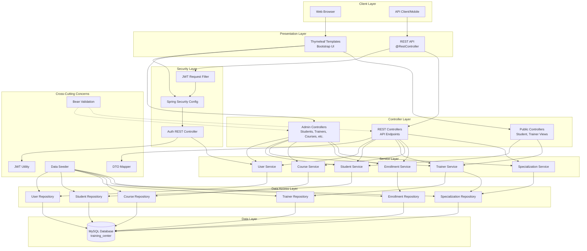

# Architecture Diagram - LearnHub Training Center

## Architecture Layers Description

### 1. **Client Layer**
- **Web Browser**: Accesses server-side rendered pages
- **API Client**: Consumes REST API (future mobile apps, SPAs)

### 2. **Presentation Layer**
- **Thymeleaf Templates**: Server-side rendering with Bootstrap 5
- **REST API**: JSON-based API with Swagger documentation

### 3. **Security Layer**
- **JWT Filter**: Intercepts requests to validate JWT tokens
- **Spring Security Config**: Currently disabled (permitAll) for development
- **Auth Controller**: Handles login/register with JWT generation

### 4. **Controller Layer**
- **Admin Controllers**: Full CRUD operations (SSR)
  - Students, Trainers, Courses, Enrollments, Specializations
- **Public Controllers**: Read-only views for students/trainers
- **REST Controllers**: API endpoints returning DTOs

### 5. **Service Layer**
Business logic implementation:
- Transaction management
- Data validation
- Business rule enforcement
- Entity-to-DTO conversion coordination

### 6. **Data Access Layer**
- Spring Data JPA repositories
- Custom queries with `@Query` and `@EntityGraph`
- Optimized lazy loading prevention

### 7. **Data Layer**
- MySQL 8.0 database
- Managed by Hibernate with `ddl-auto: update`
- Persistent storage with Docker volumes

### 8. **Cross-Cutting Concerns**
- **DTO Mapper**: Prevents lazy loading issues in JSON responses
- **Data Seeder**: Initializes database with sample data
- **JWT Util**: Token generation and validation
- **Bean Validation**: `@Valid` annotations on entities/DTOs

## Technology Stack

**Backend:**
- Spring Boot 3.4.12
- Spring Data JPA (Hibernate 6.6.36)
- Spring Security 6.4
- Spring Validation

**Database:**
- MySQL 8.0
- HikariCP connection pool

**Security:**
- JWT (jjwt 0.11.5)
- BCrypt password encoding

**API Documentation:**
- SpringDoc OpenAPI 2.5.0 (Swagger)

**Frontend:**
- Thymeleaf template engine
- Bootstrap 5.3.3
- Minimal custom CSS

**DevOps:**
- Docker & Docker Compose
- Maven build tool
- Spring Boot DevTools
