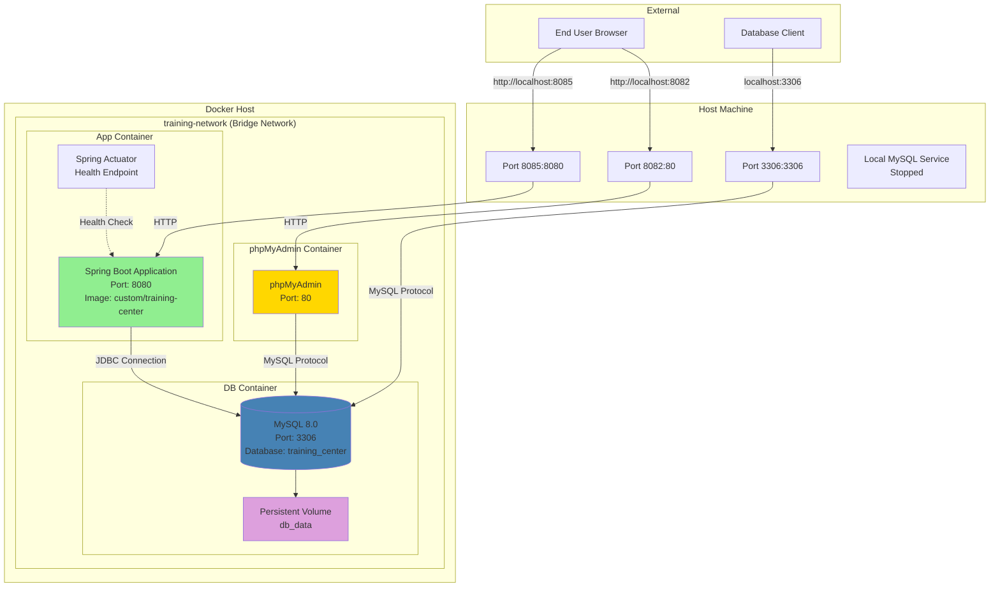

# Deployment Diagram - LearnHub Training Center



## Deployment Configuration

### Docker Compose Services

#### 1. **Application Service (app)**
```yaml
Container: training-center-app
Image: Built from Dockerfile (multi-stage)
Ports: 8085:8080 (Host:Container)
Environment:
  - SPRING_DATASOURCE_URL: jdbc:mysql://db:3306/training_center
  - SPRING_DATASOURCE_USERNAME: app
  - SPRING_DATASOURCE_PASSWORD: app
  - SPRING_PROFILES_ACTIVE: docker
  - SERVER_PORT: 8080
Depends On: db (healthy)
Networks: training-network
Health Check: curl http://localhost:8080/actuator/health
```

**Build Process:**
- Stage 1: Maven build with dependency caching
- Stage 2: Minimal JRE runtime with JAR file

#### 2. **Database Service (db)**
```yaml
Container: training-center-db
Image: mysql:8.0
Ports: 3306:3306 (Host:Container)
Environment:
  - MYSQL_DATABASE: training_center
  - MYSQL_USER: app
  - MYSQL_PASSWORD: app
  - MYSQL_ROOT_PASSWORD: root
Volumes: db_data:/var/lib/mysql
Networks: training-network
Health Check: mysqladmin ping
```

#### 3. **phpMyAdmin Service (phpmyadmin)**
```yaml
Container: training-center-phpmyadmin
Image: phpmyadmin:latest
Ports: 8082:80 (Host:Container)
Environment:
  - PMA_HOST: db
  - PMA_USER: root
  - PMA_PASSWORD: root
Networks: training-network
Depends On: db (healthy)
```

### Network Configuration

**Bridge Network: training-network**
- Isolated container communication
- Service discovery via container names
- App connects to `db:3306` (internal DNS)

### Volume Management

**Persistent Volume: db_data**
- Type: Docker volume
- Mount: /var/lib/mysql
- Persistence: Survives container restarts
- Removal: `docker compose down -v`

### Port Mappings

| Service | Internal Port | External Port | Protocol | Access URL |
|---------|--------------|---------------|----------|------------|
| Spring Boot | 8080 | 8085 | HTTP | http://localhost:8085 |
| MySQL | 3306 | 3306 | TCP | localhost:3306 |
| phpMyAdmin | 80 | 8082 | HTTP | http://localhost:8082 |
| Actuator | 8080 | 8085 | HTTP | http://localhost:8085/actuator/health |

### Health Checks

**Database:**
```bash
mysqladmin ping -h localhost -uapp -papp
Interval: 5s, Timeout: 5s, Retries: 10
```

**Application:**
```bash
curl -f http://localhost:8080/actuator/health
Interval: 30s, Timeout: 10s, Retries: 3, Start Period: 40s
```

### Deployment Steps

#### Local Development:
```bash
# Start database and phpMyAdmin
docker compose up db phpmyadmin -d

# Run Spring Boot locally
mvn spring-boot:run
```

#### Full Docker Deployment:
```bash
# Build and start all services
docker compose up -d

# View logs
docker compose logs -f app

# Stop all services
docker compose down

# Stop and remove volumes (reset database)
docker compose down -v
```

### Environment Profiles

**Default Profile (Local Dev):**
- Database: localhost:3306
- Port: 8081
- Show SQL: true
- Thymeleaf cache: false

**Docker Profile:**
- Database: db:3306 (container name)
- Port: 8080
- Show SQL: false
- Thymeleaf cache: true
- Management port: 8081 (health checks)

### Security Considerations (Production)

⚠️ **Current Issues:**
1. Security is disabled (`permitAll()`)
2. Default passwords in use
3. Root MySQL password exposed
4. JWT secret in plain text
5. No HTTPS/TLS

**Recommendations for Production:**
- Enable Spring Security with proper roles
- Use environment variables for secrets
- Implement HTTPS with Let's Encrypt
- Use Docker secrets for credentials
- Enable firewall rules
- Implement rate limiting
- Add monitoring and logging aggregation
